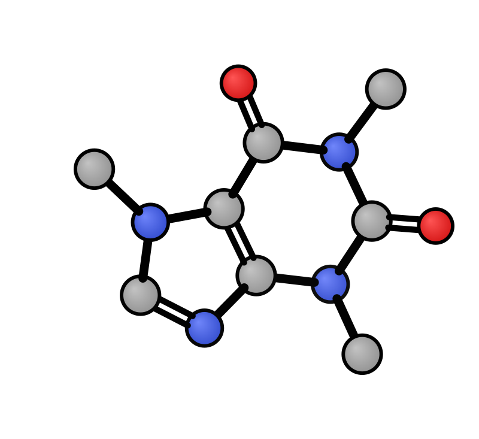
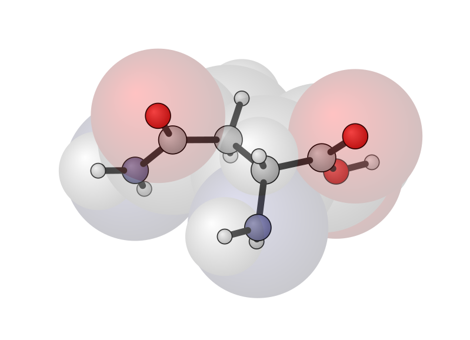
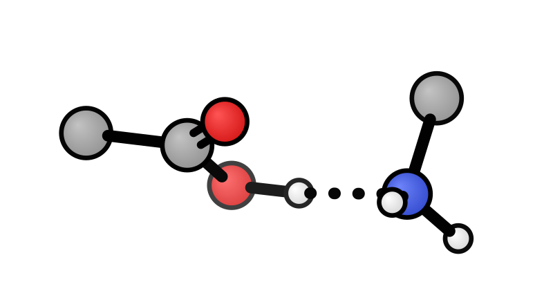
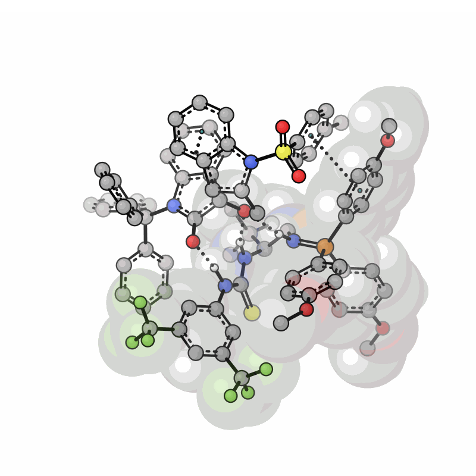

# xyzrender: Publication-quality molecular graphics from the command line.

Render molecular structures as publication-quality SVG, PNG, PDF, and animated GIF from XYZ files or quantum chemistry output.

[](https://pepy.tech/projects/xyzrender)
[](https://github.com/aligfellow/xyzrender/blob/main/LICENSE)
[](https://docs.astral.sh/uv)
[](https://github.com/astral-sh/ruff)
[](https://github.com/astral-sh/ty)
[](https://github.com/aligfellow/xyzrender/actions)
[](https://codecov.io/gh/aligfellow/xyzrender)

xyzrender turns XYZ files and quantum chemistry output (ORCA, Gaussian, Q-Chem, etc.) into clean SVG, PNG, PDF, and animated GIF graphics — ready for papers, presentations, and supporting information. The SVG rendering approach is built on and inspired by [**xyz2svg**](https://github.com/briling/xyz2svg) by [**Ksenia Briling @briling**](https://github.com/briling).

Most molecular visualisation tools require manual setup: loading files into a GUI, tweaking camera angles, exporting at the right resolution and adding specific TS or NCI bonds. `xyzrender` skips this. One command gives you a (mostly) oriented, depth-cued structure with correct bond orders, aromatic ring rendering, automatic bond connectivity, with TS bonds and NCI bonds.

 

**What it handles out of the box:**

- **Bond orders and aromaticity** — double bonds, triple bonds, and aromatic ring notation detected automatically from geometry via [`xyzgraph`](https://github.com/aligfellow/xyzgraph)
- **Transition state bonds** — forming/breaking bonds rendered as dashed lines, detected automatically from imaginary frequency vibrations via [`graphRC`](https://github.com/aligfellow/graphRC)
- **Non-covalent interactions** — hydrogen bonds and other weak interactions shown as dotted lines, detected automatically via [`xyzgraph`](https://github.com/aligfellow/xyzgraph)
- **GIF animations** — rotation, TS vibration, and trajectory animations for presentations and SI
- **VdW surface overlays** — van der Waals spheres on all or selected atoms
- **Depth fog and gradients** — 3D depth cues without needing a 3D viewer
- **Multiple output formats** — SVG (default), PNG, PDF, and GIF from the same command

**Preconfigured but extensible.** Built-in presets (`default`, `flat`, `paton`) cover common use cases. Every setting — colors, radii, bond widths, gradients, fog — can be overridden via CLI flags or a custom JSON config file.

```bash
xyzrender caffeine.xyz                          # SVG with sensible defaults
xyzrender ts.out --ts -o figure.png             # TS with dashed bonds as PNG
xyzrender caffeine.xyz --gif-rot -go movie.gif  # rotation GIF for slides
```

## Installation

### From PyPI:  

```bash
pip install xyzrender
```

Or with [uv](https://docs.astral.sh/uv/):

```bash
uv add xyzrender
```

### From Source:  

```bash
git clone https://github.com/aligfellow/xyzrender.git
cd xyzrender
pip install .
# or
pip install -e .
# or simply
pip install git+https://github.com/aligfellow/xyzrender.git
```

## Quick start

```bash
# Render from XYZ file (writes caffeine.svg by default)
xyzrender caffeine.xyz

# Render from QM output (ORCA, Gaussian, Q-Chem, etc.)
xyzrender calc.out

# Explicit output path — extension controls format
xyzrender caffeine.xyz -o render.png
xyzrender caffeine.xyz -o render.pdf

# Pipe from stdin (writes graphic.svg)
cat caffeine.xyz | xyzrender
```

Output defaults to `{input_basename}.svg`. Use `-o` to specify a different path or format.

## Examples

Sample structures are in [`examples/structures/`](examples/structures/). Rendered outputs and the generation script are in [`examples/`](examples/). To regenerate all outputs:

```bash
uv run bash examples/generate.sh
```

### Presets

| Default | Flat | Paton (pymol-like) |
|---------|------|-------|
|  |  |  |

```bash
xyzrender caffeine.xyz -o caffeine_default.svg              # default preset
xyzrender caffeine.xyz --config flat -o caffeine_flat.svg   # flat: no gradient
xyzrender caffeine.xyz --config paton -o caffeine_paton.svg # paton: PyMOL-style
```

The `paton` style is inspired by the clean styling used by [Rob Paton](https://github.com/patonlab) through PyMOL (see [gist](https://gist.github.com/bobbypaton/1cdc4784f3fc8374467bae5eb410edef))

### Display options

| All H | Some H | No H | 
|-------|--------|------|
|  |  |  | 

| Aromatic | Kekule |
|----------|--------|
|  |  |

```bash
xyzrender ethanol.xyz --hy -o ethanol_all_h.svg         # all H
xyzrender ethanol.xyz --hy 7 8 9 -o ethanol_some_h.svg  # specific H atoms
xyzrender ethanol.xyz --no-hy -o ethanol_no_h.svg       # no H
xyzrender benzene.xyz --hy -o benzene.svg               # aromatic
xyzrender caffeine.xyz --bo -k -o caffeine_kekule.svg   # Kekule bond orders
```

### VdW spheres

| All atoms | Some vdW | paton-style |
|-----------|--------|--------|
|  |  |  |

```bash
xyzrender asparagine.xyz --hy --vdw -o asparagine_vdw.svg  # VdW spheres on all atoms
xyzrender asparagine.xyz --hy --vdw "1-6" -o asparagine_vdw_partial.svg  # VdW spheres on some atoms
xyzrender asparagine.xyz --hy --vdw --config paton -o asparagine_vdw_paton.svg  # VdW spheres on all atoms
```

### Transition states and NCI

xyzrender uses [xyzgraph](https://github.com/aligfellow/xyzgraph) for molecular graph construction from Cartesian coordinates — determining bond connectivity, bond orders, detecting aromatic rings, and non-covalent interactions. It also provides element data (van der Waals radii, atomic numbers) used throughout rendering.

Transition state analysis uses [graphRC](https://github.com/aligfellow/graphRC) for internal coordinate vibrational mode analysis. Given a QM output file (ORCA, Gaussian, etc.), graphRC identifies which bonds are forming or breaking at the transition state with `--ts`. These are rendered as dashed bonds. graphRC is also used to generate TS vibration frames for `--gif-ts` animations.

NCI detection uses [xyzgraph](https://github.com/aligfellow/xyzgraph)'s `detect_ncis` to identify hydrogen bonds, halogen bonds, pi-stacking, and other non-covalent interactions from geometry. These are rendered as dotted bonds. For pi-system interactions (e.g. pi-stacking, cation-pi), centroid dummy nodes are placed at the mean position of the pi-system atoms. For trajectory GIFs with `--nci`, interactions are re-detected per frame.

| Auto TS | Manual TS bond |
|------|----------------|
|  |  |

```bash
xyzrender sn2.out --hy --ts -o sn2_ts.svg
xyzrender sn2.out --hy --ts-bond "1-2" -o sn2_ts_man.svg  # specific TS bond only
```

| Auto NCI | Manual NCI |
|------|----------------|
|  |  |

```bash
xyzrender Hbond.xyz --nci -o nci.svg                # auto-detect all NCI interactions
xyzrender Hbond.xyz --nci-bond "8-9" -o nci_man.svg  # specific NCI bond only
```

### QM output files

| ORCA | Gaussian (TS) |
|------|----------------|
|  |  |

```bash
xyzrender bimp.out -o bimp_qm.svg             # ORCA output
xyzrender mn-h2.log -o mn-h2_qm.svg --ts      # Gaussian log with TS detection
```

### GIF animations

| Rotation (y) | Rotation (xy) |
|--------------|---------------|
|  |  |

| TS vibration + rotation | TS vibration | Trajectory |
|-------------------------|--------------|------------|
|  |  |  |

```bash
xyzrender caffeine.xyz --gif-rot -go caffeine.gif                          # rotation (y-axis)
xyzrender caffeine.xyz --gif-rot xy -go caffeine_xy.gif                    # rotation (xy axes)
xyzrender bimp.out --gif-rot --gif-ts --vdw 84-169 -go bimp.gif           # TS vibration + rotation
xyzrender mn-h2.log --gif-ts -go mn-h2.gif                                # TS vibration
xyzrender bimp.out --gif-trj --ts -go bimp_trj.gif                        # trajectory with TS bonds
```

GIF defaults to `{input_basename}.gif`. Use `-go` to override.

### Combined options

The visualisation supports most combinations of these options.  
- `--gif-ts` and `--gif-trj` are *mutually exclusive*

| TS animation | trj animation |
|--------------|---------------|
|  |  |

```bash
xyzrender bimp.out --gif-ts --gif-rot --nci --vdw 84-169 -go bimp_nci_ts.gif  # TS animation + nci + vdw + rotate
xyzrender bimp.out --gif-trj --nci --ts --vdw 84-169 -go bimp_nci_trj.gif  # TS bonds + nci + vdw + trj
```

## Orientation

Auto-orientation is on by default (largest variance along x-axis). Disabled automatically for stdin and interactive mode.

```bash
xyzrender molecule.xyz                         # auto-oriented
xyzrender molecule.xyz --no-orient             # raw coordinates
xyzrender molecule.xyz -I                      # interactive rotation via v viewer
```

### Interactive rotation (`-I`)

The `-I` flag opens the molecule in the [**v** molecular viewer](https://github.com/briling/v) by [Ksenia Briling **@briling**](https://github.com/briling)
for interactive rotation. Rotate the molecule to the desired orientation, press
`z` to output coordinates, then close the window with `q`. `xyzrender` captures the rotated
coordinates and renders from those.

We can also pipe from v directly: 
- *though this won't work for computational output files*

```bash
v molecule.xyz | xyzrender
```

Orient the molecule, press `z` to output reoriented coordinates, then `q` to close.

This must be installed separately if this option is to be used. The executable should be in `~/bin/` for discovery. 

*TODO: Look into cleaning up this integration.*

## Styling

### Config presets

Use `--config` to load a styling preset. Built-in presets: `default`, `flat`, `paton`, `custom`.

CLI flags override preset values:

```bash
xyzrender caffeine.xyz --config paton --bo      # paton preset but with bond orders on
xyzrender caffeine.xyz --config default --no-fog
```

### CLI styling flags

| Flag | Description |
|------|-------------|
| `-a`, `--atom-scale` | Atom radius scale factor |
| `-b`, `--bond-width` | Bond line width |
| `-s`, `--atom-stroke-width` | Atom outline width |
| `--bond-color` | Bond color (hex) |
| `-S`, `--canvas-size` | Canvas size in pixels (default: 800) |
| `-B`, `--background` | Background color (hex, default: `#ffffff`) |
| `-G`, `--gradient-strength` | Gradient contrast |
| `-F`, `--fog-strength` | Depth fog strength |
| `--grad` / `--no-grad` | Toggle radial gradients |
| `--fog` / `--no-fog` | Toggle depth fog |
| `--bo` / `--no-bo` | Toggle bond order rendering |
| `--vdw-opacity` | VdW sphere opacity |
| `--vdw-scale` | VdW sphere radius scale |
| `--vdw-gradient` | VdW sphere gradient strength |

### Custom presets

Create a JSON file with any combination of settings:

```json
{
  "canvas_size": 800,
  "atom_scale": 2.5,
  "bond_width": 20,
  "atom_stroke_width": 3,
  "gradient": true,
  "gradient_strength": 1.5,
  "fog": true,
  "fog_strength": 1.2,
  "background": "#ffffff",
  "bond_orders": false,
  "colors": {
    "C": "#D9D9D9",
    "H": "#FAFAFA",
    "N": "#7F7FBF",
    "O": "#FF0D0D"
  }
}
```

```bash
xyzrender caffeine.xyz --config my_style.json
```

The `colors` key maps element symbols to hex colors, overriding the default CPK palette.

## GIF animation

Requires `cairosvg` and `Pillow` (`pip install 'xyzrender[gif]'`).

| Flag | Description |
|------|-------------|
| `--gif-ts` | TS vibration GIF (via graphRC) |
| `--gif-trj` | Trajectory/optimization GIF (multi-frame input) |
| `--gif-rot [axis]` | Rotation GIF (default: y). Combinable with `--gif-ts` |
| `-go`, `--gif-output` | GIF output path (default: `{basename}.gif`) |
| `--gif-fps` | Frames per second (default: 10) |
| `--rot-frames` | Rotation frame count (default: 120) |

Available rotation axes: `x`, `y`, `z`, `xy`, `xz`, `yz`, `yx`, `zx`, `zy`. Prefix `-` to reverse (e.g. `-xy`).

## All CLI flags

| Flag | Description |
|------|-------------|
| `-o`, `--output` | Static output path (.svg, .png, .pdf) |
| `-c`, `--charge` | Molecular charge |
| `-m`, `--multiplicity` | Spin multiplicity |
| `--config` | Config preset or JSON path |
| `--debug` | Debug logging |
| `-I`, `--interactive` | Interactive rotation via `v` viewer |
| `--orient` / `--no-orient` | Auto-orientation toggle |
| `--ts` | Auto-detect TS bonds via graphRC |
| `--ts-frame` | TS reference frame (0-indexed) |
| `--ts-bond` | Manual TS bond pair(s) (1-indexed) |
| `--nci` | Auto-detect NCI interactions |
| `--nci-bond` | Manual NCI bond pair(s) (1-indexed) |
| `--hy` | Show H atoms (no args=all, or 1-indexed) |
| `--no-hy` | Hide all H atoms |
| `-k`, `--kekule` | Use Kekule bond orders (no aromatic 1.5) |
| `--vdw` | VdW spheres (no args=all, or index ranges) |

## Development

Requires [uv](https://docs.astral.sh/uv/) and [just](https://github.com/casey/just).

```bash
git clone https://github.com/aligfellow/xyzrender.git
cd xyzrender
just setup   # install dev dependencies
just check   # lint + type-check + tests
```

| Command | Description |
|---|---|
| `just check` | Run lint + type-check + tests |
| `just lint` | Format and lint with ruff |
| `just type` | Type-check with ty |
| `just test` | Run pytest with coverage |
| `just fix` | Auto-fix lint issues |
| `just build` | Build distribution |
| `just setup` | Install all dev dependencies |

### CI

GitHub Actions runs lint, type-check, and tests on every push to `main` and every PR targeting `main`. Coverage is uploaded to [Codecov](https://codecov.io).

## License

[MIT](LICENSE)

## Acknowledgements

The SVG rendering in xyzrender is built on and heavily inspired by [xyz2svg](https://github.com/briling/xyz2svg) by [Ksenia Briling @briling](https://github.com/briling). The CPK colour scheme, core SVG atom/bond rendering logic, fog, and overall approach originate from that project. The radial gradient (pseudo-3D) rendering was contributed to xyz2svg by [Iñigo Iribarren Aguirre @iribirii](https://github.com/iribirii).

Key dependencies:

- [xyzgraph](https://github.com/aligfellow/xyzgraph) — bond connectivity, bond orders, aromaticity detection and non-covalent interactions from molecular geometry
- [graphRC](https://github.com/aligfellow/graphRC) — reaction coordinate analysis and TS bond detection from imaginary frequency vibrations
- [cclib](https://github.com/cclib/cclib) — parsing quantum chemistry output files (ORCA, Gaussian, Q-Chem, etc.)
- [CairoSVG](https://github.com/Kozea/CairoSVG) — SVG to PNG/PDF conversion
- [Pillow](https://github.com/python-pillow/Pillow) — GIF frame assembly

Generated from [aligfellow/python-template](https://github.com/aligfellow/python-template).

<details>
<summary>Updating from the template</summary>

If this project was created with [copier](https://copier.readthedocs.io/), you can pull in upstream template improvements:

```bash
# Run from the project root
copier update --trust
```

This will:

1. Fetch the latest version of the template
2. Re-ask any questions whose defaults have changed
3. Re-render the templated files with your existing answers
4. Apply the changes as a diff — your project-specific edits are preserved via a three-way merge

If there are conflicts (e.g. you modified the `justfile` and so did the template), copier will leave standard merge conflict markers (`<<<<<<<` / `>>>>>>>`) for you to resolve manually.

The `--trust` flag is required because the template defines tasks (used for `git init` on first copy). The tasks don't run during update, but copier requires trust for any template that declares them.

Requires that the project was originally created with `copier copy`, not the plain GitHub "Use this template" button.

</details>
